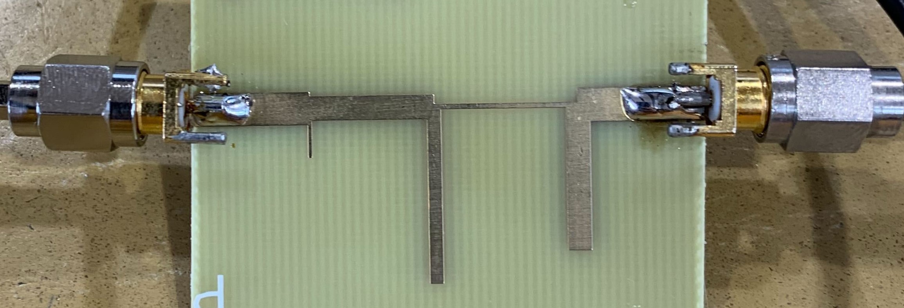

# RF-Filter

This project was to design and manufacture a 5th order maximally flat stub RF filter with a cutoff freqeuncy of 2Ghz

----

### Process

A 5th order maximally flat stub RF filter with a cutoff of 2Ghz in QUCS:

Simulation of the Schematic:

The generated PCB layout of the stub filter:

The EM simulation of the PCB layout: 

### Verification and Lab Testing

The result of the filter measured with a spectrum analyzer 

### Takeaways

The final design achieved a very close freqeuncy  cutoff of 1.935Ghz compared to the simulated 2.0Ghz.

Going forward it could be beneficial to have the filter attenuate faster. I found the draw back from steeper attenuation when simulating was the bandwidth of the filter was reduced, since the bandwidth was more important I sacrificed the attenuation. 

Overall I am happy with the results and am excited to manufacture a amplifier PCB with a matching network using open stubs. 